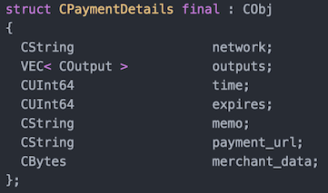
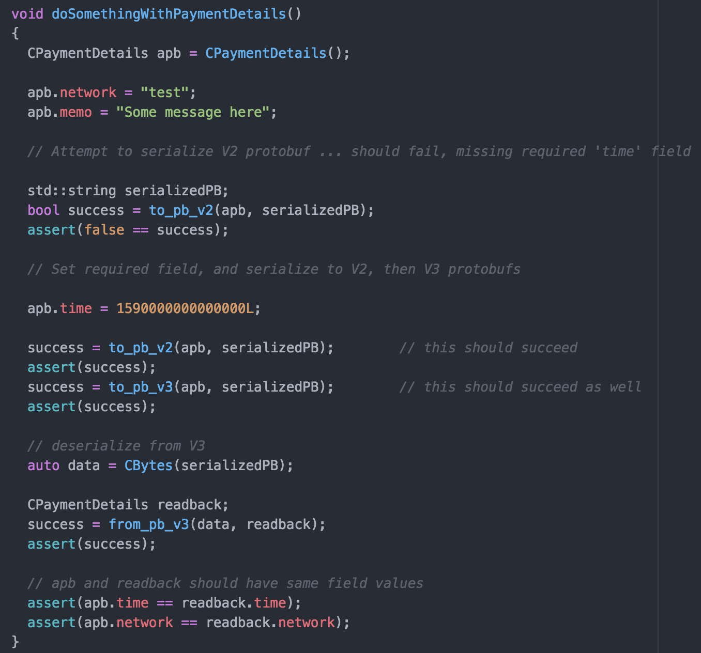

# AbstractPB : C++11 abstraction layer for Google Protobuffers

## Example Generated Struct
Using a protoc plugin provided by this project, a simple C++ struct will be generated for each message.  Here is one generated for PaymentDetails.proto [Version 2](example/messagesV2/PaymentDetails.proto) and
[Version 3](example/messagesV3/PaymentDetailsV3.proto) message definitions.  Your application code never deals directly with C++ generated classes.

## Example Usage
An application uses the AbstractPB generated structs and the `apb_to_pb()` and `apb_from_pb()` functions only.  The rest of the protobuf C++ API is abstracted away to allow seamless V2 and V3 protobuf support and cleaner code.

## Goals

### 1. Simultaneous support for V2 and V3 protobufs without impacting application code
Migrating from V2 protobufs to V3 protobufs can be tricky, especially if your application has to be able to support either version at runtime.  Additionally, should be able to switch between libprotobuf versions without impacting application code.

### 2. Cross-Platform
Applications running on MacOS, Linux, Windows should be able to share same library.

### 3. Abstraction messages are simple structs with property-like members
Rather than calling msg.set_timestamp(x), use msg.timeStamp = x .

### 4. Field isSet tests
Be able to tell when Primitive type fields are set.  All primitive types are wrapped in objects for this reason.

### 5. Objective-C Helpers
When using Objective-C on MacOS / OS X, the C++ libprotobuf can be awkward, and you need to explicitly convert to/from NSStrings or NSData.  While there is an (Objective-C implementation of libprotobuf)[https://github.com/google/protobuf/releases], the focus of this project is for cross-platform C++ applications.

## Guidelines

### 1. V3 messages extend V2 messages
In order for an abstraction struct to be used for both v2 an v3 messages, the V3 message definition must only add fields, not remove any fields you deprecate.  All fields are optional in V3.

### 2. Message name same, but different package
Keep the message name the same, but place them in a different package.
